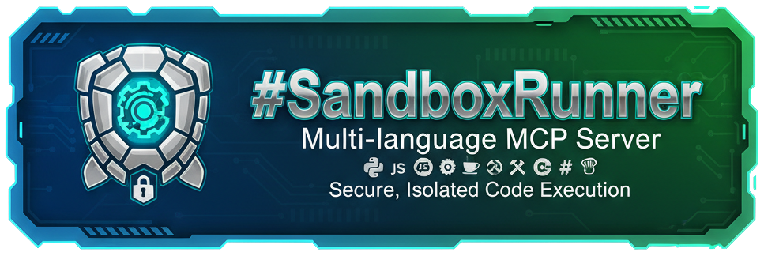

# SandboxRunner



Multi-language MCP (Model Context Protocol) server providing isolated sandbox environments for secure code execution. Uses runc/OCI containers for process isolation and supports Python, JavaScript/TypeScript, Go, Rust, Java, C++, C#, and Shell.

## Features

- Secure containerized code execution with runc/OCI
- Multi-language support with language-specific handlers
- Resource monitoring and limits (CPU, memory, disk)
- SQLite-based persistence for sandbox state
- MCP protocol over stdio or HTTP/WebSocket
- Configurable security policies and audit logging

## Quick Start

Build and run:
```bash
make build
make run
```

Generate configuration:
```bash
make config
```

Run tests:
```bash
make test
```

## Documentation

- [Getting Started](docs/getting-started.md) - Setup and basic usage
- [API Documentation](docs/api/README.md) - Tool reference
- [Guides](docs/guides/README.md) - Usage guides and tutorials
- [Languages](pkg/languages/README.md) - Language-specific capabilities
- [Production Deployment](PRODUCTION_DEPLOYMENT.md) - Deployment guide
- [Operations Runbook](OPERATIONS_RUNBOOK.md) - Operations and monitoring

## Configuration

Server configuration is managed through `config/mcp-sandboxd.yaml`. See [Getting Started](docs/getting-started.md) for configuration options.

## Requirements

- Go 1.24+
- runc container runtime
- Linux with container support

## License

MIT
